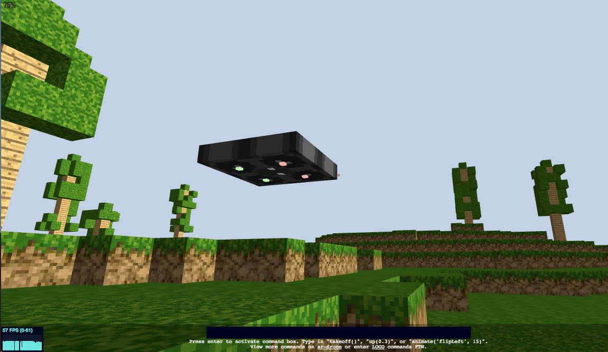

# voxel-ardrone-remote

TCP server to control a virtual drone running on the browser.

## Install

Download this repo:

```
$ git clone https://github.com/pgte/voxel-ardrone-remote.git
$ cd voxel-ardrone-remote
```

Install dependencies:

```
$ npm install
```


## Run

```
$ npm start
```

Open the browser in this URL:

[http://localhost:3000](http://localhost:3000)

(works better on Chrome)



## TCP Server

Besides an HTTP server running on port 3000, this also launches a TCP server running on port 3001.

You can accesss it from the command line by using, for instance telnet or (preferably) netcat:

```
$ nc localhost 3000
```

Now you can issue commands.

## Protocol

Each command is a JSON-encoded array terminated by a new-line character.

Each command has the following structure:

```js
[<command>, <arguments>, <id>]
```

The `command` is a string identifying the command ("takeoff", "land", "stop", "up", "down", "left", "right", etc..).

`arguments` is an array of arguments. Can be empty (`[]`), or contain the arguments required for that specific command (see the available commands and arguments in [the `ar-drone` API docs](https://github.com/felixge/node-ar-drone#client-api)).

`id` is a mandatory number that identifies the command


### The response

To each command, the server responds with a new-line terminated and JSON-encoded string like this:

```js
[<result>, <id>]
```

`result` is an array. The first position of that array is the error (`null` if no error, and the second is the result, if any).


### Example interaction

```
$ nc localhost 3001
["takeoff",[],1]
[[null],1]
["left",[0.1],2]
[[null],2]
```